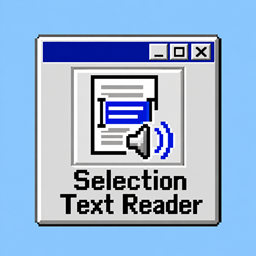

# Selection Text Reader

A simple Chrome and Edge extension that reads selected text aloud from the extension menu.

## Installation

1. Open the extensions page in Chrome or Edge.
2. Enable **Developer mode**.
3. Click **Load unpacked**.
4. Select this project folder.

## Usage

- Select text on a web page, click the extension icon, and choose **Start reading**.
- Click **Stop reading** in the extension menu to stop playback.
- The browser's top-level right-click item changes between **Start reading** and **Stop reading** based on playback state.
- The extension automatically detects the selected text language before speaking.
- Use the settings page to turn detection on or off and adjust the fallback language, speed, pitch, and volume.
- After selecting text, use the small on-page button to open a reading panel.
- The panel can read the original text or translate it into a selected language and read the translation.
- When the selection button is visible, press **R** to open the on-page reading panel.
- Long selections are split into sentences and read continuously.
- Pause, resume, previous sentence, next sentence, and reading progress are available in the on-page panel.
- Text selected inside standard input fields and text areas is supported.
- The settings page can select an installed voice and disable the on-page selection button.
- The current sentence is highlighted on the original web page while it is spoken.
- A fixed Windows 98-style mini player appears during reading.
- Chinese, English, Japanese, and Korean can each use a different preferred voice.
- Installed Windows and macOS system voices are detected automatically and labeled in the voice list.
- **Scan screen text** lets you drag over part of the current tab, recognize text locally with PP-OCRv5 and ONNX Runtime Web, then read or copy the result.
- The OCR runtime and recognition models are bundled with the extension. OCR works offline, and screenshots stay on the device.
- Screen OCR supports mixed Chinese, Japanese, and English. The Korean + English setting uses its own PP-OCRv5 recognition model.
- Translation still uses Google Translate and requires an internet connection.
- The interface can be switched between English, Simplified Chinese, Traditional Chinese, Japanese, Korean, Thai, and Malay.
