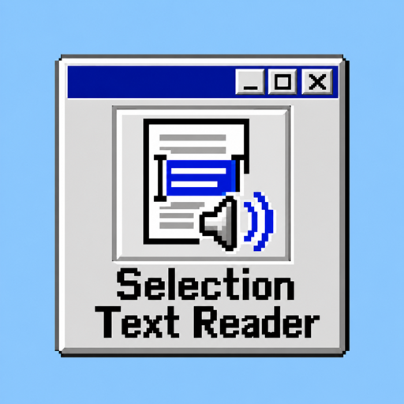

<p align="center">
  
</p>

<h1 align="center">Selection Text Reader</h1>

<p align="center">
  <strong>🖱️ Select text. Hear it read aloud.</strong><br>
  A Chrome and Edge extension for reading selected text, listening to translations, and scanning text with offline OCR.<br>
  All in a familiar Windows 98-style interface.
</p>

<p align="center">
  
  
  
  <a href="LICENSE"></a>
</p>

<p align="center">
  <a href="#features">✨ Features</a> ·
  <a href="#installation">📦 Installation</a> ·
  <a href="#usage">🎧 Usage</a> ·
  <a href="#shortcuts">⌨️ Shortcuts</a> ·
  <a href="#faq">💬 FAQ</a>
</p>

---

<a id="features"></a>

## ✨ Features

| Feature | What it does |
| --- | --- |
| 🖱️ Read selected text | Select text on a web page and start reading from the floating button, extension menu, right-click menu, or keyboard shortcut. Selections in standard input fields and text areas are supported too. |
| 🎧 Continuous playback | Long passages are split into sentences automatically. Pause, resume, skip between sentences, and follow the progress while the current sentence is highlighted on the page. |
| 🌐 Translate and read | Choose a target language in the reading panel, view the translation, and listen to it. |
| 🔍 Screen text recognition | Select an area in the visible part of the current tab to extract text from images and page elements. Edit, copy, or read the recognized text aloud. |
| 🧠 Offline OCR | Bundled **PP-OCRv5 + ONNX Runtime Web** models process images on your device. Mixed Chinese, Japanese, and English text is supported; Korean and English use a separate recognition model. |
| 🎙️ Custom voices | Detect the text language automatically, set preferred voices for Chinese, English, Japanese, and Korean, and adjust speed, pitch, and volume. |
| 🖥️ Retro mini player | Control playback right on the page with Windows 98-style windows, buttons, and playback controls. |
| 🌏 Multilingual interface | Available in English, Simplified Chinese, Traditional Chinese, Japanese, Korean, Thai, and Malay. |

> 💡 **Useful for:** listening to long articles, practicing languages, reading web content aloud, and extracting text from images or page elements.

<a id="installation"></a>

## 📦 Installation

### 1. Download the project

Open the [project repository](https://github.com/ShadowsLunarfox/Selection-Text-Reader), click **Code → Download ZIP**, and extract the archive to a folder you plan to keep.

<details>
<summary>🛠️ Prefer Git? Clone the repository instead</summary>

```bash
git clone https://github.com/ShadowsLunarfox/Selection-Text-Reader.git
```

</details>

The OCR models and runtime are already included. **Load the extension directly—no Python, Node.js, or build commands are required.** Keep the complete project folder, especially `assets/` and `vendor/`.

### 2. Load it in your browser

Use **Chrome 114 or later**, or a recent version of **Microsoft Edge (Chromium)**. Copy the appropriate address below into your browser's address bar:

| Browser | Extensions page | Steps |
| --- | --- | --- |
| Google Chrome | `chrome://extensions/` | Enable **Developer mode** → Click **Load unpacked** |
| Microsoft Edge | `edge://extensions/` | Enable **Developer mode** → Click **Load unpacked** |

Select the extracted **folder that contains `manifest.json`**. Once loaded, **Selection Text Reader** and its logo will appear in your extensions list.

### 3. Pin the icon and start reading

1. Open the extensions menu in your browser toolbar and pin **Selection Text Reader**.
2. **Refresh any pages that were already open** to enable the selection button and reading panel.
3. Select some text, click the extension icon, and choose **Start reading**.
4. Open **Voice and speed settings** to adjust the language and voice.

> 📁 Your browser loads the extension from the folder you selected, so keep that folder after installation. After updating its files, click **Reload** on the extensions page and refresh the web page you are using.

<a id="usage"></a>

## 🎧 Usage

### 🖱️ Read selected text

1. Select the text you want to hear on a regular web page.
2. Click the **floating logo button** beside your selection to open the reading panel.
3. Click **Read original**. Use the panel or mini player to pause, resume, move between sentences, or stop playback.

You can also start reading from the extension menu, the right-click menu, or <kbd>Alt</kbd> + <kbd>Shift</kbd> + <kbd>R</kbd>. The right-click menu switches between **Start reading** and **Stop reading** based on the playback state.

### 🌐 Translate and read

1. Select text and open the reading panel.
2. Choose a target language from the **Translate to** dropdown.
3. Click **Translate and read** to display the translation and start playback.

Translation uses Google Translate and requires an internet connection. Reading the translation requires an available voice for the target language in your browser.

### 🔍 Scan text on the page

1. Click the extension icon in the toolbar and choose **Scan screen text**.
2. Drag to select a text area within the **visible part of the current web page**. Press <kbd>Esc</kbd> to cancel.
3. Once recognition finishes, review or edit the result, then choose **Read text**, **Copy text**, or **Scan again**.

For Korean text, choose **Korean + English** under **Screen OCR language** in settings. The first scan needs to initialize the bundled models; processing time depends on your device and the selected area. For small text, try zooming in on the page and selecting a smaller region.

<a id="shortcuts"></a>

## ⌨️ Keyboard Shortcuts

| Shortcut | Action |
| --- | --- |
| <kbd>Alt</kbd> + <kbd>Shift</kbd> + <kbd>R</kbd> | Read selected text |
| <kbd>Alt</kbd> + <kbd>Shift</kbd> + <kbd>P</kbd> | Pause or resume reading |
| <kbd>Alt</kbd> + <kbd>Shift</kbd> + <kbd>S</kbd> | Stop reading |
| <kbd>R</kbd> | Open the reading panel after selecting text |
| <kbd>Esc</kbd> | Cancel the OCR area selection |

The first three are default shortcuts; the active bindings depend on your browser settings. To change them or resolve conflicts, open `chrome://extensions/shortcuts` or `edge://extensions/shortcuts`.

## ⚙️ Voice and Preferences

Open **Voice and speed settings** from the extension menu:

| Setting | Description |
| --- | --- |
| Interface language | Choose from 7 interface languages. |
| Automatically detect selected text language | Choose the reading language automatically, or disable detection and set a fallback language. |
| Default voice / Voices by language | Choose from available system or extension voices, with separate preferences for Chinese, English, Japanese, and Korean. |
| Speed / Pitch / Volume | Adjust playback and use **Test voice** to hear the result. |
| Show the on-page selection button | Show or hide the floating logo button when text is selected. |
| Screen OCR language | Select the appropriate option for Chinese, English, Japanese, or Korean text. |

Click **Save settings** when you are done. Available voices depend on the speech services provided by your operating system and browser.

## 🏠 Offline and Online Features

| Feature | How it works |
| --- | --- |
| Screen OCR | Runs on your device using bundled models. Screenshots are not uploaded to an OCR service, and no model downloads are needed. |
| Text reading | Uses your browser's speech services. Offline availability depends on the selected voice. |
| Translation | Sends the text to Google Translate and requires an internet connection. |

<a id="faq"></a>

## 💬 FAQ

<details>
<summary><strong>Why doesn't the selection button appear after installation?</strong></summary>

Refresh the page, select the text again, and make sure **Show the on-page selection button** is enabled in settings. Browser pages such as `chrome://` and `edge://`, along with some restricted pages, do not allow the reading panel. Try a regular web page.

</details>

<details>
<summary><strong>Why is there no sound, or no voice for my language?</strong></summary>

Open settings, check the volume, and click **Test voice**. If a suitable voice is missing, install a speech pack for that language in your operating system, then reopen the browser and extension settings. Your system and browser provide the voice list; online voices also require a working internet connection.

</details>

<details>
<summary><strong>Can OCR scan other applications on my desktop?</strong></summary>

The scanner captures the visible area of the current browser tab. To scan an image, display it on a web page where the extension can run, then start a scan. Busy backgrounds, outlined lettering, and very small text can affect recognition. Try zooming in and correcting any mistakes in the result box.

</details>

<details>
<summary><strong>Why is the project download relatively large?</strong></summary>

The project includes ONNX Runtime Web, text detection and recognition models, and character dictionaries so OCR can run locally. Keep the complete `vendor/` directory. Removing its models or runtime files will prevent OCR from working.

</details>

## 📄 License

This project is licensed under [GNU GPL v3](LICENSE).

Bundled third-party components retain their own licenses. See the [ONNX Runtime license](vendor/onnxruntime/LICENSE) and [PP-OCR model and dictionary notices](vendor/ppocr/NOTICE.md).

---

<p align="center">
  <br>
  <strong>Selection Text Reader</strong><br>
  Select · Read · Translate · Scan
</p>
